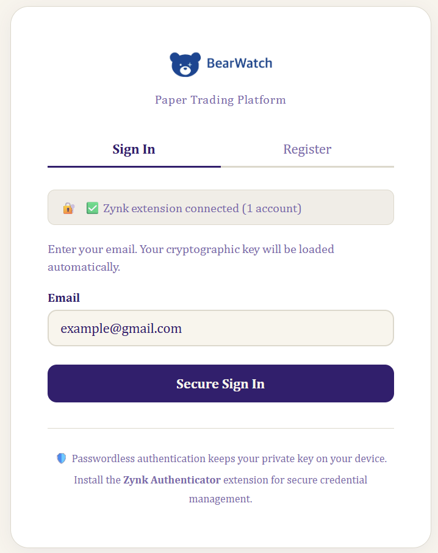
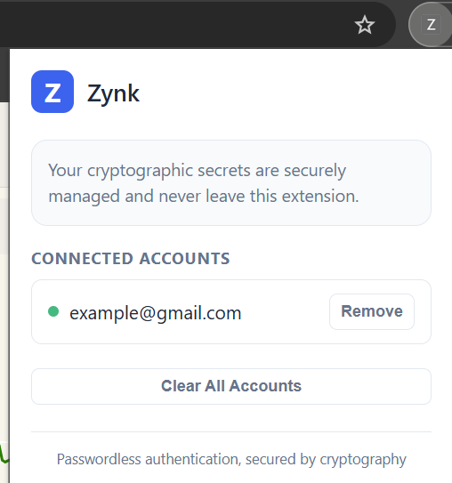
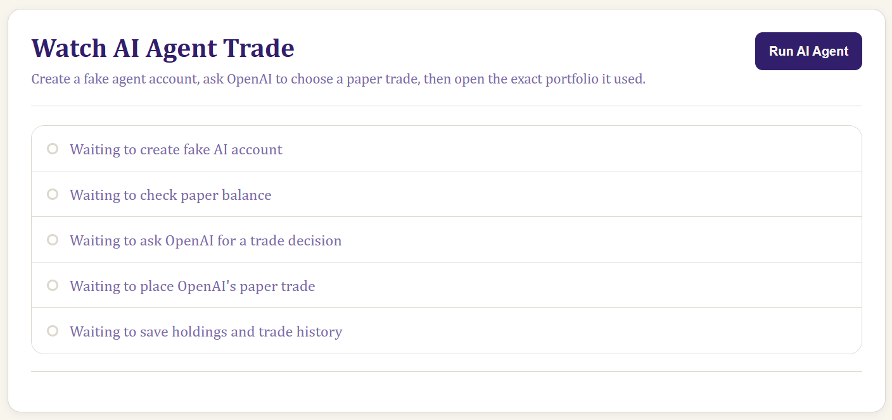
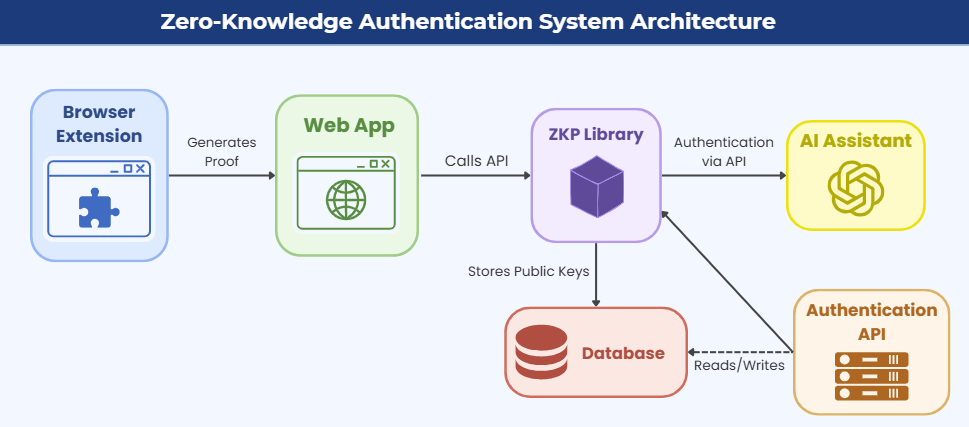

# Zynk: Passwordless Cryptographic Authentication


Zynk is a senior capstone project that explores passwordless authentication through cryptographic proof of private-key ownership. Instead of sending a password, the client signs a short-lived server challenge and the server verifies it against the user's registered public key.

The project demonstrates a reusable passwordless authentication library through an Express API, a Chrome extension for client-side credential management, and BearWatch, a paper-trading application used to showcase integration. It also includes an authenticated AI stock agent demonstrating how AI-enabled applications can securely authenticate users.

> **Technical note:** The current prototype uses Ed25519 challenge-response signatures. It proves possession of a private key without transmitting that key; it is not a general-purpose zero-knowledge proof system such as a zk-SNARK.

## Screenshots

| Bearwatch sign in | Zynk Authenticator |
| --- | --- |
|  |  |

### AI Agent Integration



## Key Features

- **Passwordless authentication:** users authenticate with an Ed25519 public/private key pair
- **Replay resistance:** Bearwatch uses single-use 32-byte challenges with timestamp validation
- **Client-side signing:** private-key operations run locally and secrets are never sent to the server
- **Browser integration:** a Chrome Manifest V3 extension manages client credentials
- **Reusable backend:** an Express REST API supports registration, login, sessions, and user profiles
- **End-to-end demo:** Bearwatch includes portfolios, simulated trades, market data, and an optional OpenAI-powered agent
- **Modular architecture:** authentication logic is encapsulated in a reusable library that can be integrated into multiple applications

## System Architecture



The authentication logic is encapsulated in a reusable library that can be integrated into multiple applications. BearWatch serves as the demonstration application, while the AI agent illustrates how authenticated AI workflows can leverage the same authentication system.

1. The client generates an Ed25519 key pair and registers the public key.
2. The server creates a random, time-limited challenge.
3. The client signs `public key + challenge + timestamp` with its private key.
4. The server validates the timestamp, challenge, signature, and registered public key.
5. The challenge is consumed and the server creates an authenticated session.

## My Contributions

Zynk was developed as a three-person senior capstone. My primary contributions included:

- Designing and implementing the Ed25519 challenge-signing and signature verification workflow
- Adding single-use challenges and timestamp validation to mitigate replay attacks
- Integrating passwordless registration and login into the Express API and Bearwatch
- Building browser-extension support for client-side credential management
- Developing and testing an AI-agent proof of concept that authenticates before accessing paper-trading tools
- Contributing to system architecture, integration testing, and debugging

## Technology Stack

| Area | Technologies |
| --- | --- |
| Cryptography | Ed25519, `@noble/curves`, `@noble/hashes` |
| Authentication API | Node.js, Express, Express Session, MySQL |
| Browser client | JavaScript, Chrome Extension Manifest V3 |
| Demo application | Python, Flask, Dash, SQLite |
| Market features | Plotly, pandas, yfinance, scikit-learn |
| AI agent | OpenAI API with tool calling |
| Testing | Jest, Mocha, Selenium |

## Quick Start

### Prerequisites

- Python 3.10 or newer
- A Chromium-based browser
- An OpenAI API key only for the optional AI-agent feature

### Run Bearwatch

From the repository root in PowerShell:

```powershell
cd bearwatch
python -m venv .venv
.\.venv\Scripts\Activate.ps1
python -m pip install -r requirements.txt
python "test1.01.py"
```

Open [http://localhost:5000](http://localhost:5000).

### Load the Zynk Extension

1. Open `chrome://extensions` in Chrome or Edge.
2. Enable **Developer mode** and select **Load unpacked**.
3. Choose the repository's `browser_extension` directory.
4. Refresh the Bearwatch login page and confirm it says **Zynk extension connected**.

### Optional: Enable the AI Agent

Set your API key before starting Bearwatch:

```powershell
$env:OPENAI_API_KEY="your-api-key"
$env:OPENAI_MODEL="gpt-4o-mini" # optional
python "test1.01.py"
```

The agent uses only a simulated paper-trading account and cannot execute real financial transactions.

## Standalone API and Tests

The separate Express/MySQL integration runs on port 3000:

```powershell
npm install
npm start --workspace core_api
```

It reads `DB_HOST`, `DB_USER`, `DB_PASSWORD`, `DB_DATABASE`, and `SESSION_SECRET` from `core_api/.env`. Run its tests with:

```powershell
npm test --workspace core_api
```

## Security Scope

Zynk is an educational prototype, not a production authentication provider. Production use would require HTTPS, CSRF protection, rate limiting, persistent challenge storage, secure hardware- or OS-backed key storage, key recovery and rotation, security auditing, and consideration of a standard such as WebAuthn.

## License

Provided for educational and portfolio purposes. No open-source license has been granted.
